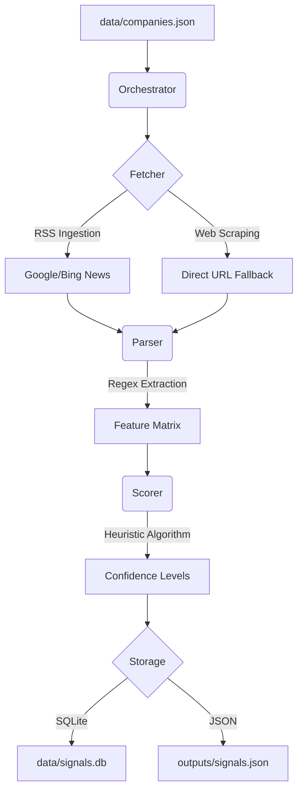

# 🚀 Signal Detection System: InterviewGod

[](https://www.python.org/downloads/)
[](https://opensource.org/licenses/MIT)
[]()

A high-performance, serverless signal detection engine designed to identify mass hiring events and corporate expansion signals in real-time. Built for **Vikaas.ai** to provide proactive talent market intelligence without the overhead of expensive LLM APIs.

---

## 💎 Value Proposition for Vikaas.ai
In the competitive landscape of talent acquisition, **timing is everything**. This system transforms public RSS feeds and web data into actionable intelligence. By detecting expansion signals (e.g., "new hub in Bangalore", "hiring 5k engineers") before they hit major job boards, Vikaas.ai can:
- **Proactive Outreach**: Initiate conversations with companies *during* their expansion phase.
- **Market Intelligence**: Track competitor growth and regional hiring trends.
- **Cost Efficiency**: Zero-cost ingestion via local parsing instead of expensive AI tokens.

---

## 🏗️ Architecture & Design

### High-Level Flow


### Design Approach
- **Data Ingestion**: A dual-strategy approach using connection-pooled RSS fetching with an automated fallback to full-page BeautifulSoup scraping for deeper context.
- **Scoring Logic**: A weighted heuristic model (`Total = Volume*0.4 + Source*0.4 + Keywords*0.2`) that balances volume magnitude, source credibility (Tier 1 vs Tier 3), and linguistic expansion markers.
- **Assumptions & Limitations**:
    - *Assumption*: News titles and summaries contain the most critical volume data.
    - *Limitation*: Relies on public indexing; highly private hiring (unannounced) will not be captured.
    - *Limitation*: Heuristic-based, so nuanced context might be missed compared to an LLM, though accuracy for numerical data is higher.

---

## 🛠️ Setup & Usage

### Prerequisites
- Python 3.12 or higher
- Pip

### 1. Installation
```bash
# Clone the repository
git clone https://github.com/Rov-er-ing/InterviewGod.git
cd InterviewGod

# Install dependencies
pip install -r requirements.txt
```

### 2. Configuration
Edit `data/companies.json` to add your target companies:
```json
[
  {
    "name": "Zomato",
    "aliases": ["Zomato Ltd"],
    "domain": "zomato.com"
  }
]
```

### 3. Run Detection
```bash
# Run the live pipeline
python orchestrator.py

# Run a local demo with mock signals
python demo.py
```

### 4. Running Tests
```bash
python -m pytest tests/
```

---

## 📊 Sample Output (`signals.json`)
```json
{
    "company_name": "Infosys",
    "title": "Infosys to hire 10,000 freshers this year",
    "url": "https://reuters.com/business/infosys-hiring",
    "score": 100.0,
    "confidence": "High",
    "parsed_data": {
        "max_volume": 10000,
        "has_expansion_keywords": true,
        "source_tier": "tier1"
    }
}
```

---

## 📜 Architecture Decision Record (ADR)
**Decision**: Choice of Python & Local-First Processing
**Status**: Accepted
**Context**: We needed a system that is rapid to deploy, cost-effective, and maintains total data privacy for the target list.
**Rationale**: 
- **Python**: Best-in-class libraries for scraping (`BeautifulSoup`) and RSS parsing (`feedparser`).
- **FastAPI**: While currently running via an Orchestrator, the stack is designed to be wrapped in FastAPI for low-latency local API access in the next phase.
- **Local-First**: Eliminates dependency on external LLM availability and per-token costs.

---

## ⚖️ License
MIT License. Created by Antigravity for InterviewGod.
