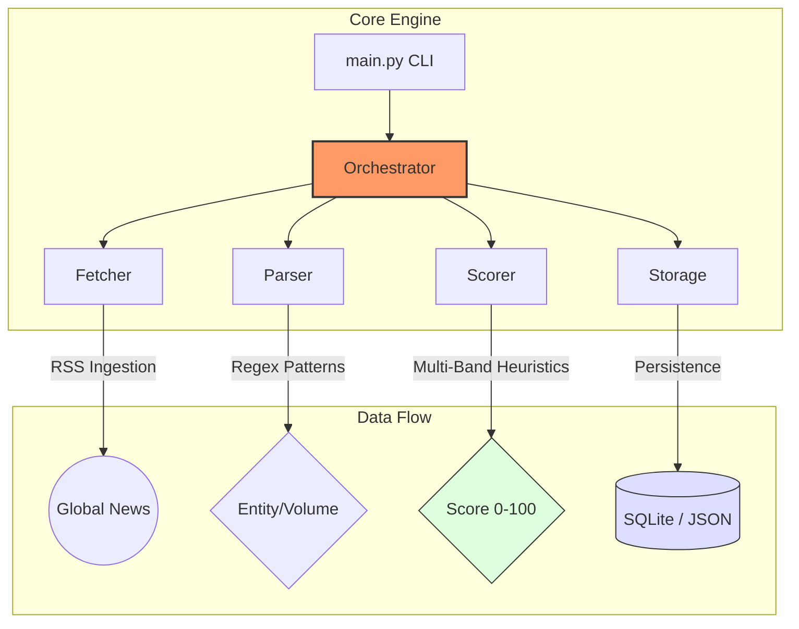

# ⚡ Signal Detection System (SDS)
> **Advanced Hiring Market Intelligence & Scale-Up Detection**

[](tests/)
[](signals/)
[]()

## 💎 Value Proposition
The **Signal Detection System (SDS)** identifies massive hiring surges and expansion signals *before* they hit mainstream job boards. By monitoring "Scale-Up Signals" in real-time news across global IT and tech sectors, SDS provides a data-driven "first-mover" advantage for identifying companies in rapid expansion.

---

## 🏗️ System Architecture


---

## 🛠️ Tech Stack & Decisions (ADR-001)

**Decision**: Local-first Python 3.12+ Architecture.

*   **Rationale**: Python's superior ecosystem for regex-based NLP and RSS ingestion (`feedparser`, `bs4`) allowed for rapid development of the tiered matching engine.
*   **Local-First Philosophy**: We prioritized privacy and zero-latency processing. By keeping the intelligence engine local, we avoid heavy cloud costs while maintaining 100% control over the scraping heuristics.
*   **Extensibility**: The modular design allows adding new signal types (e.g., funding rounds, executive shifts) by simply dropping a new module into `signals/`.

---

## 🚀 Quick Start (Get Shit Done)

### 1. Install
```bash
pip install -r requirements.txt
```

### 2. Detect Signals
```bash
# Run production pipeline (Threshold 50)
python main.py

# Run with custom threshold for higher sensitivity
python main.py --threshold 30 --verbose
```

### 3. Review Intelligence
Intelligence is delivered to:
*   `outputs/signals.json` (Human-readable export)
*   `data/signals.db` (Persistent historical archive)

---

## ☁️ Serverless Deployment

This system is pre-configured for deployment to **AWS Lambda** using the Serverless Framework.

### 1. Prerequisites
*   Node.js (for Serverless CLI)
*   `npm install -g serverless`
*   AWS Credentials configured

### 2. Deploy
```bash
# Install serverless plugins
npm install

# Deploy to AWS
sls deploy
```

### 3. API Usage
Once deployed, you can trigger detection via HTTP:
*   `POST /detect`: Run pipeline (optionally pass `{"companies": ["Name"], "threshold": 50}`)
*   `GET /signals`: Retrieve stored signals

---

## 📊 Scoring Formula (PRD §3.6)
We use a **Multi-Band Additive Scoring** system to eliminate noise:
*   **Tier 1 Keyword**: +20 pts (e.g., "massive hiring")
*   **Tier 2 Keyword**: +10 pts (e.g., "expanding")
*   **Volume Bonus**: +15 pts (if > 1000 roles detected)
*   **Recency Bonus**: +10 pts (if article < 48h old)
*   **Negative Penalty**: -50 pts (e.g., "layoffs", "freeze")

---

## 📂 Project Structure
```text
signal-detector/
├── main.py                 # CLI Entry Point
├── api.py                  # FastAPI Serverless Wrapper
├── serverless.yml           # AWS Lambda Configuration
├── config.yaml             # Sources & Thresholds
├── signals/
│   ├── orchestrator.py      # Logic Coordinator
│   └── mass_hiring/         # Core Detection Modules
├── utils/
│   ├── storage.py           # persistence (SQLite/JSON)
│   └── logger.py            # Unified logging
└── data/
    └── companies.json       # Target watchlist
```

---
**Crafted with precision. Results, not promises.**
